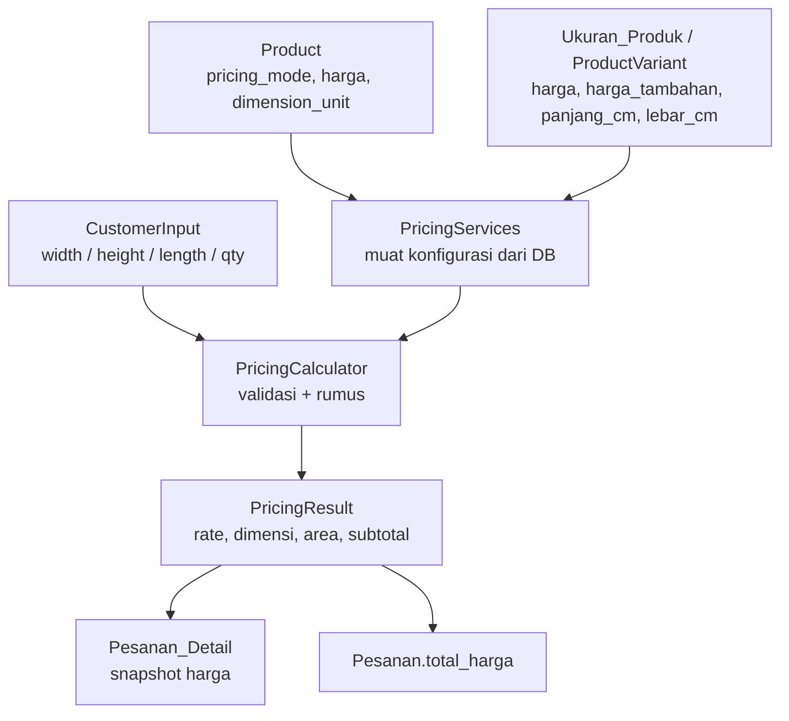

# Pricing System (Sistem Harga)

Dokumen ini menjelaskan bagaimana harga product dihitung di Katalog
Percetakan. Sebelumnya aplikasi hanya punya **satu** cara menghitung harga:
`harga product + harga tambahan varian`, dikali `qty`. Sekarang setiap product
**mendefinisikan sendiri** cara harganya dihitung lewat konfigurasi — bukan
lewat nama product.

- Model/domain: [`Models/Pricing.cs`](../Models/Pricing.cs)
- Kalkulasi (sumber kebenaran): [`Services/PricingCalculator.cs`](../Services/PricingCalculator.cs)
- Pembacaan konfigurasi dari DB: [`Services/PricingServices.cs`](../Services/PricingServices.cs)
- Migrasi database: [`Schema/migration_pricing_modes.sql`](../Schema/migration_pricing_modes.sql)
- Tes: [`tests/Percetakan.Tests/PricingCalculatorTests.cs`](../tests/Percetakan.Tests/PricingCalculatorTests.cs)

## 1. Mengapa Banyak Pricing Mode Dibutuhkan

Product percetakan tidak semuanya dihargai dengan cara yang sama:

| Product | Cara harga wajar |
|---|---|
| Spanduk / Banner | per luas (m²), karena ukuran bebas |
| Standing Banner | harga tetap per unit, ukuran sudah ditentukan |
| Business Card | per unit / kuantitas |
| Sticker | bisa per luas |
| Kain / Fabric | bisa per meter lurus |
| Brosur | per kuantitas |

Memaksa semua product memakai satu rumus (mis. per meter) membuat product
fixed-size salah harga, dan menebak perilaku dari `product.nama` rapuh:
mengganti nama product akan mengubah harga. Karena itu perilaku harga
dijadikan **konfigurasi per product**.

> **Aturan penting:** jangan pernah menulis `if (product.Nama == "Banner")`.
> Perilaku harga hanya boleh berasal dari `product.pricing_mode`.

## 2. Arsitektur Harga Sebelumnya

```
product.harga  +  Ukuran_Produk.harga_tambahan   (jika ukuran dipilih)
        │
        ▼
   harga_satuan  x  qty  =  Pesanan_Detail / Pesanan.total_harga
```

Semua logika ada di `Services/PesananServices.cs` (`GetHargaSatuanAsync`),
tidak ada validasi dimensi, dan tidak ada cara menyatakan "harga per m²".

## 3. Arsitektur Harga Sekarang

```
Customer input (width/height/length/qty)
        │
        ▼
Controller/PesananController.cs        (parsing + validasi awal)
        │
        ▼
Services/PricingServices.cs            (baca konfigurasi dari DB)
        │  product.pricing_mode / harga / dimension_unit
        │  Ukuran_Produk.harga / harga_tambahan / panjang_cm / lebar_cm
        ▼
Services/PricingCalculator.cs          (satu-satunya rumus + validasi)
        │
        ▼
PricingResult  →  Pesanan_Detail (snapshot)  +  Pesanan.total_harga
```

- **Backend adalah sumber kebenaran.** Client tidak pernah mengirim harga.
- **Satu jalur perhitungan** (`PricingCalculator`), dipakai untuk validasi
  (controller) dan untuk menyimpan pesanan (dalam transaksi DB).

## 4. Pricing Mode yang Didukung

`PricingMode` (`Models/Pricing.cs`):

| Mode | Arti | Input dimensi | Harga |
|---|---|---|---|
| `Fixed` | harga tetap per unit | tidak ada | `unitPrice x qty` |
| `PerArea` | harga per m² | `width`, `height` | `width x height x rate x qty` |
| `PerLength` | harga per meter lurus | `length` | `length x rate x qty` |
| `PerUnit` | harga per unit/kuantitas | tidak ada | `unitPrice x qty` |
| `Custom` | cadangan | mengikuti aturan khusus | saat ini seperti `Fixed` |

`Custom` disediakan agar mode baru bisa ditambahkan tanpa mengubah arsitektur
(lihat [§18](#18-cara-menambah-pricing-mode-baru)).

## 5. Data Model

### `product`

| Kolom | Tipe | Keterangan |
|---|---|---|
| `harga` | `DECIMAL(15,2)` | Arti tergantung mode: harga satuan / per m² / per meter |
| `pricing_mode` | `VARCHAR(20)` NOT NULL DEFAULT `'Fixed'` | Mode harga |
| `dimension_unit` | `VARCHAR(20)` NOT NULL DEFAULT `'meter'` | Satuan input dimensi (`centimeter` / `meter`) |

### `Ukuran_Produk` (varian)

| Kolom | Tipe | Keterangan |
|---|---|---|
| `nama` | `VARCHAR(50)` | Nama ukuran, mis. `60 x 160 cm` |
| `harga_tambahan` | `DECIMAL(15,2)` | Tambahan harga (perilaku lama) |
| `harga` | `DECIMAL(15,2)` NULL | Harga absolut varian (override) |
| `panjang_cm` | `INT` NULL | Dimensi tetap varian (cm) |
| `lebar_cm` | `INT` NULL | Dimensi tetap varian (cm) |

### `Pesanan_Detail` (snapshot)

| Kolom | Tipe | Keterangan |
|---|---|---|
| `harga_satuan` | `DECIMAL(15,2)` | Rate snapshot (per unit / m² / meter) |
| `pricing_mode` | `VARCHAR(20)` NULL | Mode saat pesanan dibuat |
| `width_m` / `height_m` / `length_m` | `DECIMAL(12,4)` NULL | Dimensi ternormalisasi (meter) |
| `dimension_unit` | `VARCHAR(20)` NULL | Satuan input asli |
| `subtotal` | `DECIMAL(15,2)` NULL | Subtotal snapshot baris |

`Pesanan.total_harga` = jumlah `subtotal` seluruh detail.

## 6. Product vs Product Variant

Varian product direpresentasikan oleh tabel **`Ukuran_Produk`** (sudah ada
sebelum perubahan ini). Harga dikonfigurasi di **kedua level** dengan aturan
sederhana dan tunggal:

```
rate = varian.harga                       (jika diisi)
       ?? product.harga + varian.harga_tambahan
```

Alasan:

- **`Fixed` + ukuran tetap** (Standing Banner 60×160 vs 80×180) butuh harga
  per varian → pakai `Ukuran_Produk.harga` (`panjang_cm`/`lebar_cm` sebagai
  dimensi tetap).
- **`PerArea` / `PerLength` / `PerUnit`** pada dasarnya adalah rate di level
  product → cukup `product.harga`.
- Varian **tanpa** `Ukuran_Produk.harga` tetap memakai `harga_tambahan`,
  sehingga data lama tidak perlu diubah.

`pricing_mode` **tidak** disimpan per varian; mode dimiliki product. Bila suatu
saat mode perlu berbeda per varian, tambahkan kolom
`Ukuran_Produk.pricing_mode` dan gabungkan di `PricingServices` — kalkulator
tidak perlu berubah.

## 7. Rumus Harga

```
rate = Ukuran_Produk.harga ?? (product.harga + Ukuran_Produk.harga_tambahan)

Fixed / Custom :  subtotal = rate x qty
PerUnit        :  subtotal = rate x qty
PerArea        :  area     = width_m x height_m
                  subtotal = area x rate x qty
PerLength      :  subtotal = length_m x rate x qty
```

Contoh hasil (sesuai tes otomatis):

| Mode | Konfigurasi | Input | Subtotal |
|---|---|---|---|
| Fixed | rate 150.000 | qty 2 | **Rp300.000** |
| PerArea | rate 25.000/m² | 3 m × 1 m, qty 2 | **Rp150.000** |
| PerLength | rate 20.000/m | 5 m, qty 2 | **Rp200.000** |
| PerUnit | rate 50.000 | qty 3 | **Rp150.000** |

Uang dibulatkan **2 desimal** dengan `MidpointRounding.AwayFromZero`
(`PricingCalculator.Round`), konsisten dengan `DECIMAL(15,2)`.

## 8. Penanganan Satuan (Unit Handling)

- **Satuan internal = METER.** Semua perhitungan m² / panjang memakai meter.
- `product.dimension_unit` menentukan satuan angka yang dikirim customer:
  `centimeter` atau `meter`.
- Konversi terpusat di `PricingUnits.ToMeters(value, unit)` —
  **tidak** disebar ke controller/service lain.
- Dimensi varian (`panjang_cm`, `lebar_cm`) selalu dalam cm (informatif; tidak
  dipakai sebagai faktor harga karena harga `Fixed` sudah per unit).

Alur eksplisit:

```
Input customer (satuan product.dimension_unit)
    ↓ validasi (> 0)
    ↓ PricingUnits.ToMeters(...)
Nilai ternormalisasi (meter)
    ↓ PricingCalculator
Subtotal
```

## 9. Aturan Validasi

Validasi bergantung pada mode dan berada di `PricingCalculator` (dipakai ulang
oleh controller untuk pesan `400` yang jelas, lalu diulang di dalam transaksi
saat menyimpan pesanan):

| Mode | Aturan |
|---|---|
| `Fixed` | `qty > 0`; **menolak** `width`/`height`/`length` |
| `PerArea` | `width > 0`, `height > 0`, `qty > 0`; menolak `length` |
| `PerLength` | `length > 0`, `qty > 0`; menolak `width`/`height` |
| `PerUnit` | `qty > 0`; menolak `width`/`height`/`length` |
| `Custom` | mengikuti aturan khusus (saat ini seperti `Fixed`) |

Dimensi yang tidak relevan **tidak** diabaikan diam-diam: mengirim
`width` pada product `Fixed` menghasilkan `400`.

## 10. Perilaku API

### Katalog product

`GET /api/v1/products` menyertakan `pricingMode` dan `dimensionUnit`:

```json
{
  "id": 1,
  "nama": "Spanduk",
  "harga": 25000.00,
  "pricingMode": "PerArea",
  "dimensionUnit": "meter"
}
```

`POST /api/v1/products` (multipart) menerima form field opsional
`PricingMode` dan `DimensionUnit`. Nilai tak dikenal → `400`.

`GET /api/v1/products/{id}/ukuran` mengembalikan daftar varian:

```json
[
  {
    "id": 3,
    "idProduct": 1,
    "nama": "60 x 160 cm",
    "hargaTambahan": 0.00,
    "harga": 150000.00,
    "panjangCm": 60,
    "lebarCm": 160
  }
]
```

### Buat / ubah pesanan

`POST`/`PUT /api/v1/pesanan` tetap **`multipart/form-data`**. Field baru per
item (opsional, dipakai sesuai mode):

| Form field | Tipe | Dipakai oleh |
|---|---|---|
| `items[N].width` | decimal | `PerArea` |
| `items[N].height` | decimal | `PerArea` |
| `items[N].length` | decimal | `PerLength` |

`items[N].qty` selalu wajib. Satuan `width`/`height`/`length` mengikuti
`product.dimensionUnit`. **Tidak ada** field harga yang diterima; bila client
mengirim `price`/`harga`, field itu diabaikan total.

Contoh `PerArea`:

```
idAlamat: 5
items[0].idProduct: 1
items[0].width: 3
items[0].height: 1
items[0].qty: 2
```

Contoh `Fixed` (Standing Banner, varian 60×160):

```
idAlamat: 5
items[0].idProduct: 7
items[0].idUkuranProduk: 3
items[0].qty: 2
```

`PesananDetailResponse` menambahkan `pricingMode`, `widthMeters`,
`heightMeters`, `lengthMeters`, `dimensionUnit`, `areaM2`, dan `subtotal`.

## 11. Perilaku Cart

Repo ini **tidak memiliki cart/keranjang di server**. Item "cart" hidup di
client dan dikirim langsung sebagai `items[]` pada `POST /api/v1/pesanan`.
Karena itu tidak ada tabel cart baru.

Data minimum per item yang harus disimpan/dikirim client:

- `idProduct` (wajib)
- `idUkuranProduk` (opsional, untuk varian)
- `qty` (wajib)
- `width` / `height` / `length` (sesuai mode)

`subtotal`/`area` **tidak** disimpan di cart karena selalu bisa dihitung ulang.
Client boleh menghitung estimasi untuk UI, tetapi server selalu menghitung
ulang harga final.

## 12. Perilaku Order

`PesananServices.CreatePesananAsync` / `UpdatePesananAsync`:

1. membuka transaksi,
2. untuk setiap item memanggil `PricingServices.EvaluateAsync(conn, tx, input)`,
3. bila product/varian tidak valid atau validasi gagal → rollback, `400`,
4. menjumlahkan `PricingResult.Subtotal` ke `Pesanan.total_harga`,
5. menulis snapshot ke `Pesanan_Detail`.

`UpdatePesananAsync` mengganti seluruh detail (detail lama di-soft delete),
tetap menghitung ulang harga dari konfigurasi saat itu.

## 13. Preservasi Harga Historis

Harga pesanan lama tidak boleh berubah bila harga product diubah:

- `Pesanan_Detail.harga_satuan` menyimpan **rate** snapshot.
- `Pesanan_Detail.subtotal` menyimpan **subtotal** snapshot (bukan dihitung
  ulang dari `product.harga` saat dibaca).
- `width_m`/`height_m`/`length_m` dan `pricing_mode` menyimpan konteks
  perhitungan.
- `Pesanan.total_harga` adalah snapshot total.

Read query memakai `COALESCE(d.subtotal, d.harga_satuan * d.qty)` sehingga baris
lama (sebelum migrasi) tetap benar. `areaM2` dihitung ulang saat query
(`width_m * height_m`) karena tidak perlu disimpan.

### 13.1 Invariant ke Midtrans

`PaymentServices.CreatePaymentAsync` **wajib** memakai `subtotal` sebagai
`price` `item_details` (dengan `quantity = 1`), bukan `harga_satuan × qty`.
Midtrans membalas `400` bila jumlah `item_details` tidak sama dengan
`transaction_details.gross_amount`, dan pada mode `PerArea` / `PerLength` /
`PerUnit` `subtotal` tidak lagi sama dengan `harga_satuan × qty`.

Qty asli dan ukuran dipindahkan ke `name` item (dipotong 50 karakter). Bila
jumlahnya tetap tidak sama, `item_details` dilewati supaya transaksi tidak
gagal `400`. Dijaga oleh `PaymentServices.BuildItemDetails` dan test di
`tests/Percetakan.Tests/PaymentItemDetailsTests.cs`.

## 14. Migrasi Database

Fresh install: [`Schema/setup.sql`](../Schema/setup.sql) sudah memuat kolom baru.

Database berjalan:

```bash
mysql -u <user> -p katalog_percetakan < Schema/migration_pricing_modes.sql
```

Migrasi bersifat **idempotent** (dicek lewat `information_schema`) dan **tidak
destruktif**:

- Menambah 2 kolom `product`, 3 kolom `Ukuran_Produk`, 6 kolom
  `Pesanan_Detail` (semua dengan `DEFAULT` / `NULL`).
- Backfill aman:
  - `Pesanan_Detail.pricing_mode = 'Fixed'` bila NULL,
  - `Pesanan_Detail.dimension_unit = 'meter'` bila NULL,
  - `Pesanan_Detail.subtotal = harga_satuan * qty` bila NULL.

Tidak ada kolom lama yang dihapus.

## 15. Kompatibilitas Mundur (Backward Compatibility)

- **Product lama** otomatis `pricing_mode = 'Fixed'` dan
  `dimension_unit = 'meter'`; rumusnya identik dengan sebelumnya
  (`harga + harga_tambahan`) × qty.
- **Varian lama** (`Ukuran_Produk.harga` NULL) tetap memakai `harga_tambahan`.
- **Klien lama** yang hanya mengirim `idProduct`, `idUkuranProduk`, `qty`
  tetap bekerja untuk product `Fixed`.
- **Pesanan lama** tetap terbaca; `subtotal` di-backfill.
- Product yang ingin memakai `PerArea`/`PerLength`/`PerUnit` **harus**
  dikonfigurasi manual (lihat [§17](#17-cara-menambah-product-baru)) — tidak
  ditebak otomatis karena salah tebak berarti salah harga.

## 16. Testing

Test ada di `tests/Percetakan.Tests/` (xUnit) dan menguji
`PricingCalculator` secara murni (tanpa database):

| # | Test | Cakupan |
|---|---|---|
| 1 | `Fixed_UsesVariantPrice_TimesQuantity` | Fixed Rp300.000 |
| 2 | `Fixed_LegacyProduct_UsesBasePlusAdditional` | kompatibilitas lama |
| 3 | `PerArea_MultipliesAreaRateQuantity` | PerArea Rp150.000 |
| 4 | `PerArea_ConvertsCentimeterInputToMeters` | konversi cm → m |
| 5 | `PerLength_MultipliesLengthRateQuantity` | PerLength Rp200.000 |
| 6 | `PerUnit_MultipliesUnitPriceQuantity` | PerUnit Rp150.000 |
| 7 | `PerArea_RejectsZeroWidth` | validasi width = 0 |
| 8 | `Quantity_Zero_FailsForEveryMode` | qty = 0 gagal (semua mode) |
| 9 | `PricingInput_ExposesNoClientPriceField` | client tidak bisa set harga |
| 10 | `LegacyProduct_DefaultsToFixedMode` | product lama → Fixed |
| 11 | `PerArea_RoundsMoneyToTwoDecimals` | pembulatan uang |
| 12 | `PricingUnitsTests` | parsing & konversi satuan/mode |

Jalankan:

```bash
dotnet test tests/Percetakan.Tests/Percetakan.Tests.csproj
```

## 17. Cara Menambah Product Baru

Menambah product **normalnya operasi data**, bukan perubahan kode:

```
Product Baru
    ↓
Pilih PricingMode        (Fixed / PerArea / PerLength / PerUnit)
    ↓
Set product.harga        (harga satuan / per m² / per meter)
    ↓
Set product.dimension_unit (meter / centimeter; hanya untuk PerArea/PerLength)
    ↓
(Perlu varian? Isi Ukuran_Produk: nama, harga, panjang_cm, lebar_cm)
    ↓
Validasi & simpan
```

### Contoh: Banner (per m²)

```sql
INSERT INTO product
    (idKategoriProduct, idStatusProduct, nama, deskripsi, harga,
     pricing_mode, dimension_unit)
VALUES
    (2, 2, 'Spanduk', 'Cetak spanduk bahan flexi', 25000,
     'PerArea', 'meter');
```

Customer mengirim `width`, `height`, `qty`.

### Contoh: Standing Banner (fixed, dua varian)

```sql
INSERT INTO product
    (idKategoriProduct, idStatusProduct, nama, deskripsi, harga,
     pricing_mode, dimension_unit)
VALUES
    (2, 2, 'Standing Banner', 'Banner berdiri', 0,
     'Fixed', 'meter');

INSERT INTO Ukuran_Produk (idProduct, nama, harga, panjang_cm, lebar_cm)
VALUES
    (LAST_INSERT_ID(), '60 x 160 cm', 150000, 60, 160),
    (LAST_INSERT_ID(), '80 x 180 cm', 200000, 80, 180);
```

Customer hanya mengirim `idProduct`, `idUkuranProduk`, `qty`.

### Contoh: Business Card (per unit)

```sql
INSERT INTO product
    (idKategoriProduct, idStatusProduct, nama, deskripsi, harga,
     pricing_mode, dimension_unit)
VALUES
    (2, 2, 'Kartu Nama', 'Cetak kartu nama', 50000,
     'PerUnit', 'meter');
```

### Contoh: Kain (per meter lurus)

```sql
INSERT INTO product
    (idKategoriProduct, idStatusProduct, nama, deskripsi, harga,
     pricing_mode, dimension_unit)
VALUES
    (2, 2, 'Kain Custom', 'Cetak kain per meter', 20000,
     'PerLength', 'meter');
```

Customer mengirim `length`, `qty`.

## 18. Cara Menambah Pricing Mode Baru

Mode baru ditambahkan **tanpa menyentuh** controller, order, atau schema:

1. Tambahkan nilai pada `enum PricingMode` (`Models/Pricing.cs`).
2. Tambahkan method kalkulasi di `PricingCalculator.cs` dan cabang pada
   `Calculate` (mis. `PricingMode.PerVolume => CalculatePerVolume(...)`).
3. Bila butuh input baru, tambahkan field di `PricingInput` dan (bila perlu
   dikirim client) pada `PesananDetailRequest` + parsing multipart.
4. Tambahkan test di `tests/Percetakan.Tests/`.
5. **Tidak perlu migrasi** untuk kolom mode (tersimpan sebagai string).
   Tambah kolom hanya bila perlu menyimpan data baru.

Contoh kerangka:

```csharp
private static PricingResult CalculatePerVolume(
    PricingConfiguration config,
    PricingInput input) { /* rumus baru */ }
```

## 19. Diagram Arsitektur



Alur cart di frontend (tidak ada cart server): `CustomerInput` dirakit client,
dikirim ke `POST /api/v1/pesanan`, lalu server menghitung ulang lewat
`PricingServices → PricingCalculator`.
